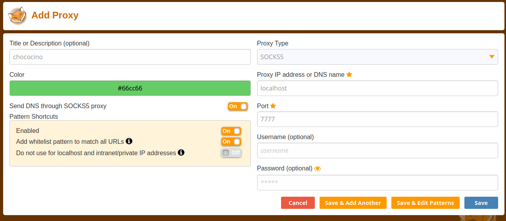
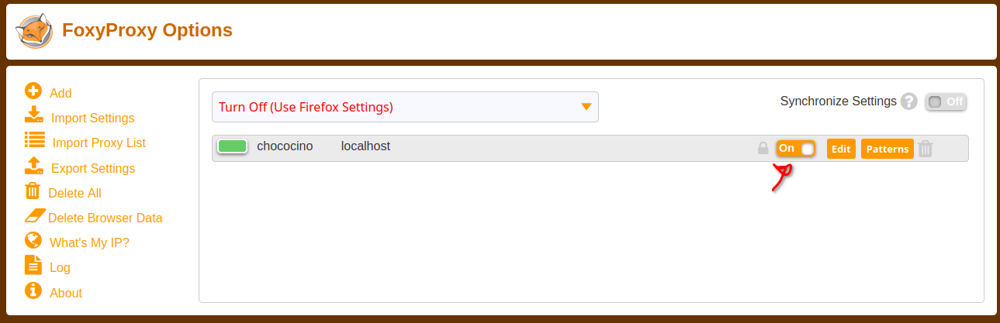

# SSH - Tunneling

Atualmente a chococino só permite acesso externo na porta 13508, que é utilizado para o ssh. Então para acessar algum recurso, seja um servidor web
ou qualquer tipo de socket rodando no cluster na sua máquina local, é necessário realizar um redirecionamento de porta via ssh.
Esse redirecionamento de porta pode ser feito por meio Local Forwarding (local -> remoto), Remote Forwading (remoto -> local) e Proxy Socks.

## 1. Local Forwarding

O Local Forwading redireciona a porta local da sua máquina para uma porta na máquina remota. Assim, você consegue ter acesso local
(via localhost) a uma aplicação que está rodando dentro do cluster da chococino. Para isso, usa-se a flag `-L` do ssh. O formato do comando é o seguinte:
```bash
# Na sua máquina local
$ ssh -L <porta_local>:<maquina_remota>:<porta_remota>
# <porta_local>: A porta da sua maquina que será redirecionada a uma porta no cluster
# <maquina_remota> O ip onde a aplicacao está rodando. ex: cm1, cm2, gpu2, gpu3 e etc
# <porta_remota>: A porta que a aplicação está rodando
```

<br>

Um exemplo disso é acessar a interface web do hadoop e spark que rodam, respectivamente, no endereço chococino:9870 e cm1:9090
```bash
# Na sua maquina local
$ ssh -L 9000:chococino:9870 -L 8000:cm1:9090 -p13508 <user>@chococino.naquadah.com.br
```
Assim, quando acessar o localhost:9000 na maquina local, será redirecionado para a aplicacao web do hadoop rodando na chococino:9870,
e o localhost:9000 redireciona para a aplicacao web do spark em cm1:9090

## 2. Remote Forwarding

O Remote Forwarding redireciona uma porta remota, do cluster, para uma porta local. Assim, você consegue ter acesso a aplicacoes rodando na sua
maquina local dentro do cluster. Para isso, é utilizado a flag `-R` do ssh. O formato do comando é o seguinte:
```bash
# Na sua maquina local
$ ssh -R <ip_remoto>:<porta_remota>:<ip_local>:<porta_local>
# <ip_remoto>: Ip da maquina do cluster. Ex: cm1, chococino e etc
# <porta_remota>: Porta que sera redirecionada no cluster
# <ip_local>: Ip para onde vai ser direcionado na maquina local. Ex: localhost, 127.0.0.1
# <porta_local>: Porta pra onde vai ser direcionada na maquina local
```

<br>

Um exemplo, é criar um servidor na web na porta 8000 e acessar dentro do cluster na porta 5000:
```bash
# Na maquina local
# cria o servidor web na porta 8000 e no localhost
$ python3 -m http.server 8000

# Remote forwarding
$ ssh -R chococino:5000:localhost:8000 -p13508 <user>@chococino.naquadah.com.br

# Dentro da chococino
cm1: $ curl chococino:5000
```

## 3. Proxy Socks

O Proxy Socks cria um tunel que redireciona toda as conexões para dentro do tunel SSH.
Essa opção facilita o acesso a aplicações rodando em diferentes máquinas, sem a necessidade de especificar cada porta que será acessada.
Para isso utilize a flag `-D <porta_local_de_proxy>` no comando SSH.
```bash
$ ssh -D <porta_local_de_proxy> -p13508 <user>@chococino.naquadah.com.br
```
Pronto, agora você tem um Proxy Socks rodando na sua máquina local na porta `<porta_local_de_proxy>`.
Há diversas formas de redirecionar conexões para o proxy, seja no escopo do navegador, local e de sistema.
<br>

### 3.1 Proxy Socks no navegador

Uma das maneiras de utilizar o proxy é por meio da extensão de navegador [FoxyProxy](https://addons.mozilla.org/pt-BR/firefox/addon/foxyproxy-standard/).
Após baixar a extensão, entre em sua página e adicione um novo proxy na opção "Add"
e preencha os dados do proxy: `Proxy Type: SOCKS5`, `Proxy IP: localhost` e `Port: <porta_local_de_proxy>`, como mostra na figura abaixo.

</img>

Após isso, inicie a conexão SSH com a flag `-D` e ative o proxy na tela inicial do
FoxyProxy

</img>

Pronto, agora toda a conexão do navegor está sendo redirecionada para o cluster chococino.
Assim, é possível acessar as aplicações web pelo navegador. Por exemplo:
`http://chococino:8088`, `http://chococino:9870` e `http://chococino:9090`.
